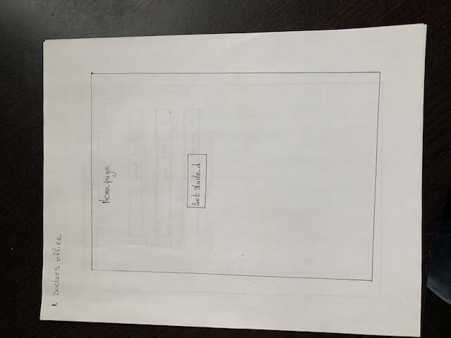
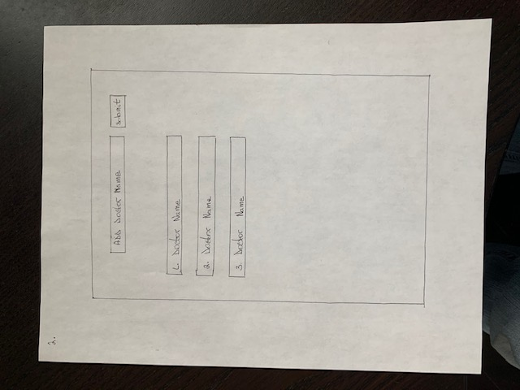
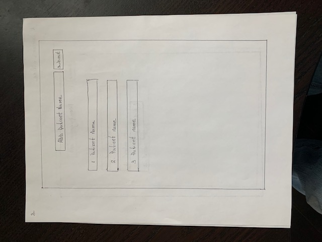
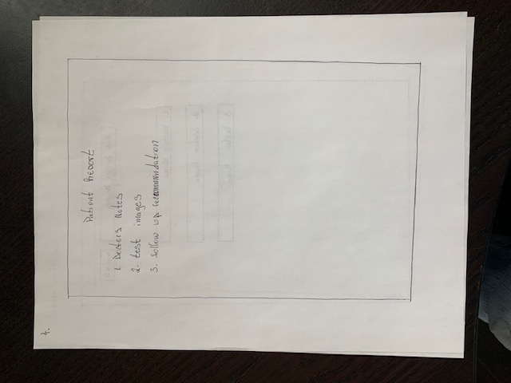

# Doctors Office

<!-- 
<--- me coding this app! -->

## Project Description

This project will be about a doctors office, where there can be many doctors, and they all can have many patients. The technologies used will include React, for the frontend, Firebase, for the backend, JSX, and CSS for styling.

## Project Links

- [github repo](https://github.com/saintaubins/doctorsOffice)
<!-- - [deployment]() -->

## Wireframes

 





	- this is my initial thinking of how I want the site to work. The doctor will see the scheduled patients, and have notes and test results for that patient, medicine prescribed, and suggested follow ups.
<!-- - [react architecture]() -->

There will be over 6 React components, some which will include, homepage, footer, header/nav bar, add doctor, add patient, and a  reports page.

### MVP/PostMVP

#### MVP
- Deploy firbase API with full CRUD.
- Deploy react UI, with full CRUD compatability to the backend.
- Create links in the nav bar.
- Show a doctor, with patients in the search field.
- Create a page to display the patients visits details. 
- Use profesional fonts on my pages.

#### PostMVP EXAMPLE
- Very detailed styling, with nice colors.
- To make it mobile reactive.
- Add react hooks, and patient billing.

## Components

| Component | Description | 
| --- | :---: |  
| App | This will make the initial data pull and include React Router| 
| Header | This will render the header include the nav | 
| Main | This will render the main page | 
| Doctor name, and list | This will render the doctors page | 
| Patient name, and list | This will render the patients page | 
| Footer | This will render the footer | 
| Navigation | This will render the navigation and links | 
| Forms and submit | This will sort through the data, and render available matches, or add data, performing CRUD | 

## Time Frames

| Component | Priority | Estimated Time | Time Invested | Actual Time |
| --- | :---: |  :---: | :---: | :---: |
| Planning | H | 4hrs | 4hrs |  |
| Create all initial files and initial React setup | H | 3hrs | hrs |  |
| Connect to API and show it responding | H | 5hrs | hrs |  |
| Develop code for App | H | 2hrs | hrs |  |
| Develop code for Header, Navigation and Main | H | 4hrs | hrs |  |
| Develop code for CRUD Description page | H | 8hrs | hrs |  |
| Stylize the app | H | 5hrs | hrs |  |
| Work on final documentation | H | 3hrs | hrs |  |
| Completing PostMVP items | H | 5hrs | hrs |  |
| Total | H | 39hrs | hrs |  |

## Additional Libraries
 <!-- Use this section to list all supporting libraries and their role in the project such as Axios, ReactStrap, D3, etc.  -->
 Still working on additional libraries.

## Code Snippet

<!-- Use this section to include a brief code snippet of functionality that you are proud of an a brief description.  Code snippet should not be greater than 10 lines of code.  -->

<!-- ```
function reverse(string) {
	// here is the code to reverse a string of text
}
``` -->
Still working on this part


## Issues and Resolutions
 <!-- Use this section to list of all major issues encountered and their resolution. -->

<!-- #### SAMPLE.....
**ERROR**: app.js:34 Uncaught SyntaxError: Unexpected identifier                                
**RESOLUTION**: Missing comma after first object in sources {} object -->
Still working on this part.